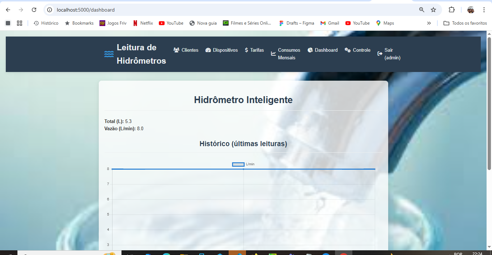
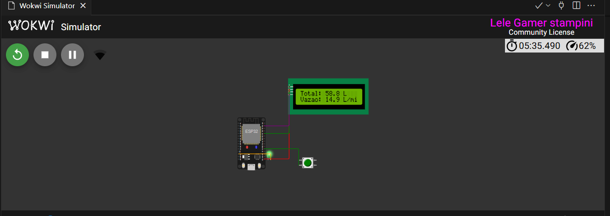
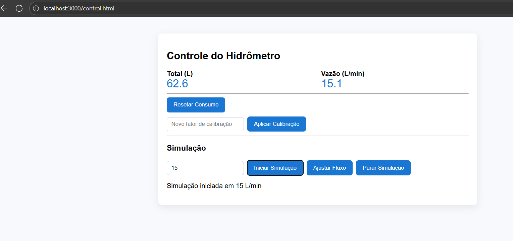
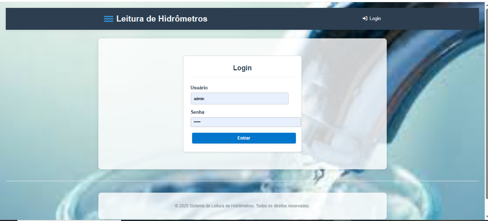
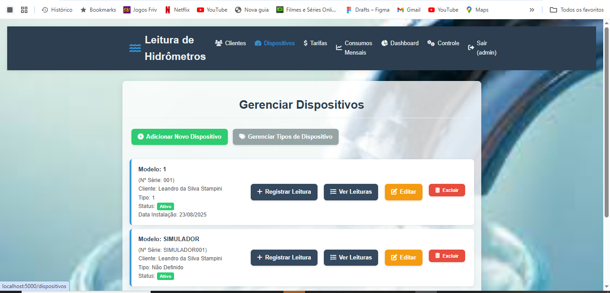
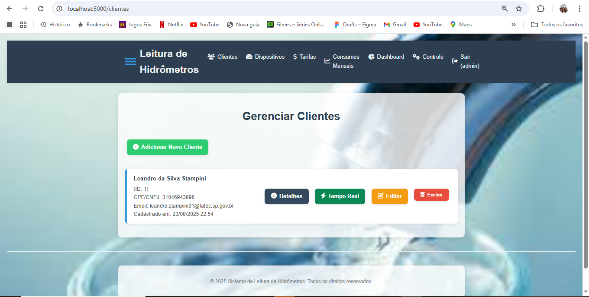
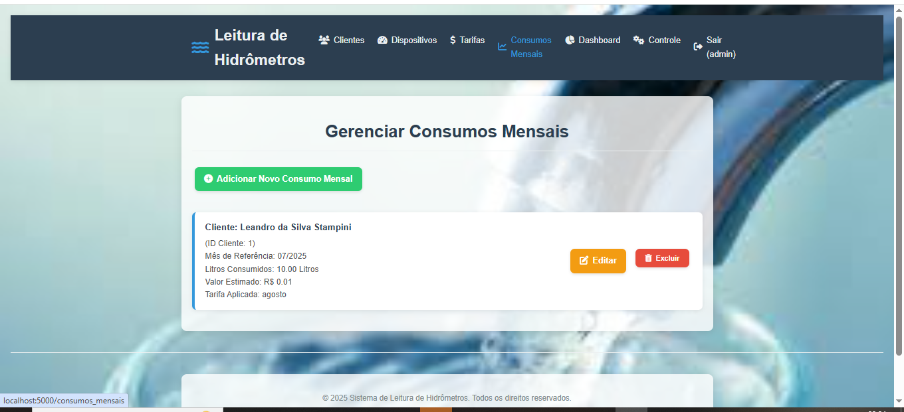
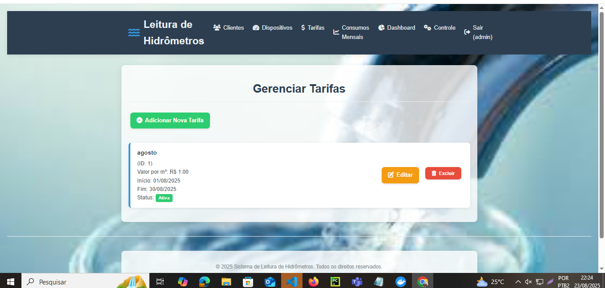
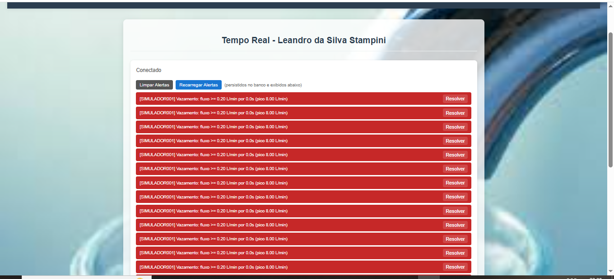

# Hidrômetro Inteligente

> Backend unificado Flask: MQTT (paho-mqtt) -> Flask + Socket.IO -> Dashboard/Controle + API REST (JWT) + Persistência SQLAlchemy.

## Sensor de Vazão YF-S201 e Estrutura dos Dados

Este projeto utiliza o sensor de vazão YF-S201 para medir o consumo hídrico. O YF-S201 funciona com uma turbina interna e um sensor Hall, gerando pulsos elétricos proporcionais ao fluxo de água.

**Cálculo da Vazão:**

```
Q (L/min) = (número de pulsos por segundo) / 7.5
```

O volume total é obtido integrando os pulsos ao longo do tempo:

```
totalLitros += vazãoInstantanea * (intervalo_ms / 60000.0)
```

**Exemplo de estrutura JSON enviada via MQTT:**

```json
{
    "id_dispositivo": "HD12345",
    "id_cliente": "C789",
    "data_hora": "2025-05-16T10:22:00",
    "consumo_litros": 38.4,
    "nivel_bateria": 3.7,
    "pressao_bar": 2.1,
    "vazamento_detectado": false,
    "totalLiters": 38.4,
    "flowLmin": 2.5
}
```

**Tópico MQTT recomendado:**

```
hidrômetro/<id_cliente>/<id_dispositivo>/dados
```

**Detecção de Vazamentos:**
- Fluxo contínuo acima do limiar (`LEAK_FLOW_THRESHOLD`) por tempo mínimo (`LEAK_MIN_SECONDS`).
- Consumo fora do padrão histórico ou em horários incomuns.

Essas regras são implementadas no backend Flask, gerando alertas e persistindo eventos conforme o artigo/TCC.




## Ferramentas necessárias
- Python 3.11+ (https://www.python.org/downloads/)
- Docker Desktop (opcional, para containers)
- VS Code (opcional, para desenvolvimento)

## Instalação e execução
    ```
    DB_ENGINE=sqlite
    MQTT_URL=mqtt://broker.hivemq.com:1883
    MQTT_TOPIC_DADOS=hidrometro/dados
    MQTT_TOPIC_CMD=hidrometro/cmd
    SECRET_KEY=changeme
    HISTORY_LIMIT=1000
    ```
4. Para iniciar todos os serviços e compilar o firmware:
    ```
    ./scripts/dev-all.ps1
    ```
5. (Opcional) Para iniciar containers Docker:
    ```
    docker compose up -d
    docker compose up -d --build # para reconstruir
    docker ps # para verificar containers
    ```
6. Acesse o dashboard: http://localhost:5000/dashboard

## Verificação do funcionamento
- Verifique se o dashboard está acessível.
- Confira se o firmware foi compilado sem erros.
- Certifique-se de que o arquivo `.env` está presente e correto.
- Instale dependências adicionais manualmente usando pip se necessário.

## Observações
1. Abra o Source Control (ícone de ramificação).
2. Adicione todos os arquivos modificados ao staging.
Marque a opção "Add Python to PATH" durante a instalação.


- Verifique se o firmware foi compilado sem erros.
- Confira se o arquivo `.env` está presente e correto.
- Se necessário, instale dependências adicionais manualmente usando pip.

## Observações
- Mensagens de aviso do VS Code sobre `Get-History -Count` podem ser ignoradas.
- O Wokwi CLI não é obrigatório para funcionamento local.


## Sumário

- [Arquitetura](#arquitetura)
- [Alterações Recentes](#alterações-recentes)
- [Configuração (.env)](#configuração-env)
- [Execução Local (Sem Docker)](#execução-local-sem-docker)
- [Login / Token](#login--token)
 - [Login Web](#login-web)
 - [Login / Token](#login--token)
- [Envio manual de leitura](#envio-manual-de-leitura)
- [Comando](#comando)
- [Funcionalidades](#funcionalidades)
- [Tecnologias](#tecnologias)
- [Estrutura do Repositório](#estrutura-do-repositório)
- [Firmware ESP32](#firmware-esp32)
- [Simulação Wokwi](#simulação-wokwi)
- [APIs e Endpoints](#apis-e-endpoints)
- [Simulação de Dados Sem Hardware](#simulação-de-dados-sem-hardware)
- [Histórico e Armazenamento](#histórico-e-armazenamento)
- [Fluxo de Desenvolvimento](#fluxo-de-desenvolvimento)
- [Erros Comuns e Soluções](#erros-comuns-e-soluções)
- [Roadmap / Próximos Passos](#roadmap--próximos-passos)

## Visão Geral

Leituras de consumo de água (litros acumulados e vazão instantânea) publicadas pelo ESP32 via MQTT são ingeridas pelo Flask, armazenadas e distribuídas em tempo real via WebSocket (Socket.IO) para o dashboard. API oferece consulta e injeção manual de dados + comandos ao dispositivo.

## Arquitetura

```
[ESP32] --MQTT--> [Broker] --MQTT--> [Flask + Socket.IO + DB]
                                       |--> Dashboard/Controle (Templates)
                                       |--> API REST (JWT)
```

## Alterações Recentes

- Remoção definitiva do backend Node (bridge migrada para Flask).
- Endpoints unificados: /api/current, /api/history, /api/data, /api/cmd.
- Autenticação JWT agora baseada em usuários persistentes (tabela Usuario) com roles (admin/user).
- Criação automática de usuário admin inicial (senha via ADMIN_PASSWORD ou 'admin').
- Adição de /healthz e /api/debug/history-size.
- Colunas total_liters e flow_lmin no modelo Leitura.
- Suporte a MySQL (via variáveis) com fallback SQLite.
- .env.example criado.
- Página de login web (/login) e proteção de rotas de interface.
- Página Tempo Real por cliente: /cliente/<id>/tempo-real mostrando dispositivos + alertas.
- Vínculo automático de dispositivo padrão a cliente (DEFAULT_DEVICE_SERIAL & DEFAULT_DEVICE_CLIENT_ID).
- Detecção de vazamento com agregação temporal (LEAK_FLOW_THRESHOLD + LEAK_MIN_SECONDS) e persistência de alertas.
- Endpoints de alertas: /api/alerts, /api/alerts/:id/resolve, /api/alerts/clear-temporary.

## Configuração (.env)
Copie `.env.example` para `.env` e ajuste:
```
DB_ENGINE=sqlite
# (ou mysql + credenciais)
MQTT_URL=mqtt://broker.hivemq.com:1883
MQTT_TOPIC_DADOS=hidrometro/dados
MQTT_TOPIC_CMD=hidrometro/cmd
SECRET_KEY=alterar-para-chave-forte
HISTORY_LIMIT=1000
# Dispositivo / cliente padrão para vincular leituras simuladas
DEFAULT_DEVICE_SERIAL=SIM123
DEFAULT_DEVICE_CLIENT_ID=1
# Alertas de vazamento
LEAK_FLOW_THRESHOLD=2.5      # L/min mínimo
LEAK_MIN_SECONDS=10          # duração mínima contínua acima do limiar
```

## Migrações
```
flask --app MVC_sistema_leitura_hidrometros/app db init   # primeira vez
flask --app MVC_sistema_leitura_hidrometros/app db migrate -m "init"
flask --app MVC_sistema_leitura_hidrometros/app db upgrade
```

## Execução Rápida (Docker)
Com docker e docker-compose instalados:
```
docker compose up -d --build
```
Isso sobe:
- flask (porta 5000)
- mosquitto (porta 1883 e 9001 websocket)

Notas:
- Agora o container executa migrações automaticamente (ou `create_all`) via `docker-entrypoint.sh`. Variável `AUTO_MIGRATE=1` controla esse comportamento.
- Em PowerShell o alias `curl` aponta para `Invoke-WebRequest`; para usar os exemplos utilize `curl.exe` ou substitua pelos comandos `Invoke-RestMethod` equivalentes.

Logs (seguindo apenas Flask):
```
docker compose logs -f flask
```
Parar serviços:
```
docker compose down
```
Build manual da imagem (alternativo):
```
docker build -t hidrometro-flask -f Dockerfile.flask .
docker run --env-file .env -p 5000:5000 hidrometro-flask
```

### Passo a passo exato (Docker + Postgres + Mosquitto)
1. Criar/copiar arquivo `.env` contendo ao menos:
```
DB_ENGINE=postgres
POSTGRES_HOST=postgres
POSTGRES_PORT=5432
POSTGRES_USER=postgres
POSTGRES_PASSWORD=postgres
POSTGRES_DB=hidrometro
MQTT_URL=mqtt://mosquitto:1883
MQTT_TOPIC_DADOS=hidrometro/leandro/dados
MQTT_TOPIC_CMD=hidrometro/leandro/cmd
SECRET_KEY=gerar-uma-chave
DEFAULT_DEVICE_SERIAL=SIM123
DEFAULT_DEVICE_CLIENT_ID=1
LEAK_FLOW_THRESHOLD=0.5
LEAK_MIN_SECONDS=10
AUTO_MIGRATE=1
```
2. Subir serviços:
```
docker compose up -d --build
```
3. Verificar containers:
```
docker compose ps
```
4. Acompanhar logs do Flask (confirme criação do admin, vínculo dispositivo e assinatura MQTT):
```
docker compose logs -f flask
```
5. Acessar a aplicação: http://localhost:5000/login (usuário admin / senha definida em ADMIN_PASSWORD ou 'admin').
6. Ir para lista de clientes e confirmar que o Cliente ID=1 existe; se não existir, criar um cliente manualmente e ajustar DEFAULT_DEVICE_CLIENT_ID ou recriar.
7. Acessar a página Tempo Real do cliente 1:
```
http://localhost:5000/cliente/1/tempo-real
```
8. Iniciar simulador (ESP32 / Wokwi) publicando JSON em `hidrometro/leandro/dados`:
```
{"totalLiters": 10.2, "flowLmin": 0.8, "numeroSerie": "SIM123"}
```
9. Validar que a linha do dispositivo aparece/atualiza e que alertas surgem se a vazão ultrapassar o limiar pelo tempo mínimo.

### Verificação rápida de vínculo de consumo ao Cliente ID=1
Use estes passos para garantir que os dados recebidos do simulador (serial SIM123) estão sendo associados ao cliente correto:
1. Conferir no log de inicialização a mensagem:
```
[INIT] Dispositivo padrão criado e vinculado ao cliente 1
```
ou
```
[INIT] Dispositivo padrão atualizado para cliente 1
```
2. Emitir uma leitura MQTT (ou via POST /api/data) com `numeroSerie` = SIM123.
3. Verificar no banco (exemplo usando docker exec + psql):
```
docker compose exec postgres psql -U postgres -d hidrometro -c "SELECT l.id_leitura, d.numero_serie, d.cliente_id, l.total_liters, l.flow_lmin, l.data_hora FROM \"Leitura\" l JOIN \"Dispositivo\" d ON d.id_dispositivo=l.dispositivo_id ORDER BY l.id_leitura DESC LIMIT 5;"
```
Saída esperada: linhas com numero_serie = SIM123 e cliente_id = 1.
4. Alternativa via API (últimos dados em memória):
```
curl.exe http://localhost:5000/api/current
```
5. Página Tempo Real (`/cliente/1/tempo-real`) deve mostrar o dispositivo SIM123 atualizando Total (L) e Vazão.
6. (Opcional) Listar alertas para confirmar persistência:
```
curl.exe http://localhost:5000/api/alerts?unresolved=1
```

Se o cliente não estiver correto, ajustar variáveis `DEFAULT_DEVICE_SERIAL` e `DEFAULT_DEVICE_CLIENT_ID`, remover o container flask para recriar (ou ajustar no banco) e subir novamente:
```
docker compose restart flask
```

## Execução Local (Sem Docker)
```
python -m venv .venv
. .venv/Scripts/activate (Windows PowerShell: .\.venv\Scripts\Activate.ps1)
pip install -r MVC_sistema_leitura_hidrometros/requirements.txt
# (Opcional) Migrações conforme seção anterior
python MVC_sistema_leitura_hidrometros/run.py
```
Acessar http://localhost:5000/dashboard
### Verificação local (similar):
1. Definir `.env` com DEFAULT_DEVICE_SERIAL e DEFAULT_DEVICE_CLIENT_ID.
2. Rodar a aplicação.
3. Publicar leitura usando MQTT broker público ou local.
4. Conferir leitura persistida conforme comandos SQL (para SQLite, abrir `instance/app.db` com um viewer ou usar `sqlite3`).

## Login / Token
```
# (Opcional) definir senha admin antes (variável de ambiente ADMIN_PASSWORD) ou usar padrão 'admin'
curl.exe -X POST http://localhost:5000/api/login -H "Content-Type: application/json" -d '{"username":"admin","password":"admin"}'

# PowerShell (alternativa mais simples de quoting):
Invoke-RestMethod -Method Post -Uri http://localhost:5000/api/login -ContentType 'application/json' -Body (@{username='admin';password='admin'} | ConvertTo-Json)
```
Resposta: {"token":"<JWT>"}
Header: Authorization: Bearer <JWT>
Roles suportadas: admin, user (apenas admin pode /api/cmd e /api/debug/history-size).

## Login Web

Agora existe página de login de interface em `/login` com sessão baseada em cookie (Flask session). Fluxo:
1. Acesse http://localhost:5000/login
2. Informe usuário `admin` e senha (ADMIN_PASSWORD ou `admin`).
3. Após autenticação você será redirecionado à lista de clientes.

Navbar mostra links protegidos apenas se autenticado e botão de sair (`/logout`).
As rotas de interface foram protegidas com verificação de sessão simples (`login_required_view`). Essa camada é independente da API JWT; para chamadas programáticas continue usando `/api/login`.

## Envio manual de leitura
```
$token=$(curl -s -X POST http://localhost:5000/api/login -H "Content-Type: application/json" -d '{"username":"admin","password":"admin"}' | python -c "import sys, json; print(json.load(sys.stdin)['token'])")
curl -X POST http://localhost:5000/api/data -H "Authorization: Bearer $token" -H "Content-Type: application/json" -d '{"totalLiters":123.4,"flowLmin":6.7,"numeroSerie":"ABC123"}'
```

## Comando
```
curl.exe -X POST http://localhost:5000/api/cmd -H "Authorization: Bearer $token" -H "Content-Type: application/json" -d '{"action":"reset"}'
```

## Funcionalidades
- Ingestão MQTT em tempo real.
- Histórico em memória e banco (SQLAlchemy).
- Dashboard com gráfico (Socket.IO + Chart.js).
- Controle e envio de comandos MQTT.
- JWT para endpoints de escrita.
- Migrações com Flask-Migrate.
- Página Tempo Real por cliente (leituras + painel de alertas persistidos / tempo real).
- Persistência e resolução de alertas de vazamento.

## Tecnologias
- Flask, Flask-SocketIO, SQLAlchemy, Flask-Migrate, PyJWT, paho-mqtt.
- Broker: Mosquitto (ou público HiveMQ).
- Frontend: Templates Jinja + Chart.js + Socket.IO client.
- Firmware: ESP32 (Arduino framework / PubSubClient).

## Estrutura do Repositório
```
MVC_sistema_leitura_hidrometros/  # App Flask
firmware/                         # Código ESP32
frontend/                         # (legado) index está integrado via templates agora
img/                              # Screenshots
mosquitto/                        # Config broker
scripts/                          # Utilidades
```

## Firmware ESP32
Configurar tópicos MQTT conforme .env e publicar JSON:
```
{"totalLiters": 100.5, "flowLmin": 3.2, "numeroSerie": "ABC123"}
```

## Simulação Wokwi
Use `diagram.json` em https://wokwi.com/ e ajuste tópicos no código.

## APIs e Endpoints
| Método | Rota | Auth | Descrição |
|--------|------|------|-----------|
| GET | /healthz | - | Status |
| POST | /api/login | - | Obter JWT |
| GET | /api/debug/auth | (DEBUG_AUTH=1) | Lista usuários e valida senha admin |
| GET | /api/current | - | Último dado |
| GET | /api/history?limit=200 | - | Histórico recente |
| POST | /api/data | Bearer (admin/user) | Injetar leitura manual |
| POST/GET | /api/cmd | Bearer (admin) | Enviar comando MQTT |
| GET | /api/debug/history-size | Bearer (admin) | Tamanho do histórico in-memory |
| GET | /api/alerts?limit=50&unresolved=1 | - | Lista alertas (filtra não resolvidos) |
| POST | /api/alerts/<id>/resolve | - | Marca alerta como resolvido |
| POST | /api/alerts/clear-temporary | - | Limpa estado temporário de detecção (não apaga registros) |

### Uso Rápido dos Endpoints de Alertas

Listar últimos 20 alertas:
```
curl.exe http://localhost:5000/api/alerts?limit=20
```

Listar apenas alertas não resolvidos:
```
curl.exe http://localhost:5000/api/alerts?unresolved=1
```

Resolver (fechar) um alerta com id 5:
```
curl.exe -X POST http://localhost:5000/api/alerts/5/resolve
```

Limpar estado temporário de detecção (não remove registros do banco, apenas reinicia o monitor em memória):
```
curl.exe -X POST http://localhost:5000/api/alerts/clear-temporary
```

As páginas de Tempo Real por cliente carregam automaticamente os alertas persistidos e escutam os eventos em tempo real via Socket.IO (evento `alert`).

## Simulação de Dados Sem Hardware
Crie script que faça POST periódico em /api/data ou publique no tópico MQTT configurado.

## Histórico e Armazenamento
Deque em memória limitado por HISTORY_LIMIT + persistência Leitura na base. Ajuste DB_ENGINE para mysql e forneça credenciais para produção.

## Fluxo de Desenvolvimento
1. Editar código.
2. Rodar/Reload.
3. Testar endpoints e Socket.IO.
4. Criar migrações ao alterar modelos.

## Erros Comuns e Soluções
| Problema | Causa | Solução |
|----------|-------|---------|
| Sem dados no gráfico | Sem mensagens MQTT | Verificar broker / publicar teste |
| 401 nas rotas POST | Falta/erro token | Gerar token via /api/login |
| Falha MySQL | Credenciais/host incorretos | Revisar variáveis DB_* |
| Socket não atualiza | Bloqueio eventlet | Reinstalar dependências / checar porta |

## Roadmap / Próximos Passos
- Persistência avançada em banco otimizado para séries temporais (ex: TimescaleDB).
- API Keys / refresh tokens e expiração configurável.
- Exportação CSV / filtros avançados (intervalo de datas, por cliente / dispositivo).
- Notificações externas (email, webhook) para alertas.
- Painel avançado de gestão de alertas (busca, paginação, filtro por status, exportação).
- PWA (manifest + service worker) para experiência mobile.

---
Contribuições são bem-vindas.

## Telas da Aplicação

| Login | Dashboard | Dispositivos |
|-------|-----------|--------------|
|  |  |  |

| Clientes | Consumos Mensais | Tarifas |
|----------|------------------|--------|
|  |  |  |

| Controle | Tempo Real | Simulação Wokwi |
|----------|------------|-----------------|
|  |  |  |

> As imagens acima demonstram as principais janelas em execução do sistema.
