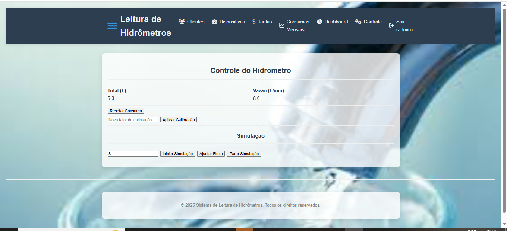

# Hidrômetro Inteligente

> Backend unificado Flask: MQTT (paho-mqtt) -> Flask + Socket.IO -> Dashboard/Controle + API REST (JWT) + Persistência SQLAlchemy.




## Sumário

- [Visão Geral](#visão-geral)
- [Arquitetura](#arquitetura)
- [Alterações Recentes](#alterações-recentes)
- [Configuração (.env)](#configuração-env)
- [Migrações](#migrações)
- [Execução Rápida (Docker)](#execução-rápida-docker)
- [Execução Local (Sem Docker)](#execução-local-sem-docker)
- [Login / Token](#login--token)
- [Envio manual de leitura](#envio-manual-de-leitura)
- [Comando](#comando)
- [Funcionalidades](#funcionalidades)
- [Tecnologias](#tecnologias)
- [Estrutura do Repositório](#estrutura-do-repositório)
- [Firmware ESP32](#firmware-esp32)
- [Simulação Wokwi](#simulação-wokwi)
- [APIs e Endpoints](#apis-e-endpoints)
- [Simulação de Dados Sem Hardware](#simulação-de-dados-sem-hardware)
- [Histórico e Armazenamento](#histórico-e-armazenamento)
- [Fluxo de Desenvolvimento](#fluxo-de-desenvolvimento)
- [Erros Comuns e Soluções](#erros-comuns-e-soluções)
- [Roadmap / Próximos Passos](#roadmap--próximos-passos)

## Visão Geral

Leituras de consumo de água (litros acumulados e vazão instantânea) publicadas pelo ESP32 via MQTT são ingeridas pelo Flask, armazenadas e distribuídas em tempo real via WebSocket (Socket.IO) para o dashboard. API oferece consulta e injeção manual de dados + comandos ao dispositivo.

## Arquitetura

```
[ESP32] --MQTT--> [Broker] --MQTT--> [Flask + Socket.IO + DB]
                                       |--> Dashboard/Controle (Templates)
                                       |--> API REST (JWT)
```

## Alterações Recentes

- Remoção definitiva do backend Node (bridge migrada para Flask).
- Endpoints unificados: /api/current, /api/history, /api/data, /api/cmd.
- Autenticação JWT simples (memória) para endpoints mutadores.
- Adição de /healthz e /api/debug/history-size.
- Colunas total_liters e flow_lmin no modelo Leitura.
- Suporte a MySQL (via variáveis) com fallback SQLite.
- .env.example criado.

## Configuração (.env)
Copie `.env.example` para `.env` e ajuste:
```
DB_ENGINE=sqlite
# (ou mysql + credenciais)
MQTT_URL=mqtt://broker.hivemq.com:1883
MQTT_TOPIC_DADOS=hidrometro/dados
MQTT_TOPIC_CMD=hidrometro/cmd
SECRET_KEY=alterar-para-chave-forte
HISTORY_LIMIT=1000
```

## Migrações
```
flask --app MVC_sistema_leitura_hidrometros/MVC_sistema_leitura_hidrometros/app db init   # primeira vez
flask --app MVC_sistema_leitura_hidrometros/MVC_sistema_leitura_hidrometros/app db migrate -m "init"
flask --app MVC_sistema_leitura_hidrometros/MVC_sistema_leitura_hidrometros/app db upgrade
```

## Execução Rápida (Docker)
(Atualize docker-compose se desejar incluir o Flask container; atualmente contém apenas mosquitto legacy — adaptar.)

Exemplo simples (sem compose pronto):
```
# Build imagem
docker build -t hidrometro-flask -f Dockerfile.flask .
# Rodar (expondo porta 5000)
docker run --env-file .env -p 5000:5000 hidrometro-flask
```
(Se ainda não existir Dockerfile específico para Flask, executar localmente conforme abaixo.)

## Execução Local (Sem Docker)
```
python -m venv .venv
. .venv/Scripts/activate (Windows PowerShell: .\.venv\Scripts\Activate.ps1)
pip install -r MVC_sistema_leitura_hidrometros/MVC_sistema_leitura_hidrometros/requirements.txt
# (Opcional) Migrações conforme seção anterior
python MVC_sistema_leitura_hidrometros/MVC_sistema_leitura_hidrometros/run.py
```
Acessar http://localhost:5000/dashboard

## Login / Token
```
curl -X POST http://localhost:5000/api/login -H "Content-Type: application/json" -d '{"username":"admin","password":"admin"}'
```
Resposta: {"token":"<JWT>"}
Header: Authorization: Bearer <JWT>

## Envio manual de leitura
```
$token=$(curl -s -X POST http://localhost:5000/api/login -H "Content-Type: application/json" -d '{"username":"admin","password":"admin"}' | python -c "import sys, json; print(json.load(sys.stdin)['token'])")
curl -X POST http://localhost:5000/api/data -H "Authorization: Bearer $token" -H "Content-Type: application/json" -d '{"totalLiters":123.4,"flowLmin":6.7,"numeroSerie":"ABC123"}'
```

## Comando
```
curl -X POST http://localhost:5000/api/cmd -H "Authorization: Bearer $token" -H "Content-Type: application/json" -d '{"action":"reset"}'
```

## Funcionalidades
- Ingestão MQTT em tempo real.
- Histórico em memória e banco (SQLAlchemy).
- Dashboard com gráfico (Socket.IO + Chart.js).
- Controle e envio de comandos MQTT.
- JWT para endpoints de escrita.
- Migrações com Flask-Migrate.

## Tecnologias
- Flask, Flask-SocketIO, SQLAlchemy, Flask-Migrate, PyJWT, paho-mqtt.
- Broker: Mosquitto (ou público HiveMQ).
- Frontend: Templates Jinja + Chart.js + Socket.IO client.
- Firmware: ESP32 (Arduino framework / PubSubClient).

## Estrutura do Repositório
```
MVC_sistema_leitura_hidrometros/  # App Flask
firmware/                         # Código ESP32
frontend/                         # (legado) index está integrado via templates agora
img/                              # Screenshots
mosquitto/                        # Config broker
scripts/                          # Utilidades
```

## Firmware ESP32
Configurar tópicos MQTT conforme .env e publicar JSON:
```
{"totalLiters": 100.5, "flowLmin": 3.2, "numeroSerie": "ABC123"}
```

## Simulação Wokwi
Use `diagram.json` em https://wokwi.com/ e ajuste tópicos no código.

## APIs e Endpoints
| Método | Rota | Auth | Descrição |
|--------|------|------|-----------|
| GET | /healthz | - | Status |
| POST | /api/login | - | Obter JWT |
| GET | /api/current | - | Último dado |
| GET | /api/history?limit=200 | - | Histórico recente |
| POST | /api/data | Bearer | Injetar leitura manual |
| POST/GET | /api/cmd | Bearer | Enviar comando MQTT |
| GET | /api/debug/history-size | Bearer | Tamanho do histórico in-memory |

## Simulação de Dados Sem Hardware
Crie script que faça POST periódico em /api/data ou publique no tópico MQTT configurado.

## Histórico e Armazenamento
Deque em memória limitado por HISTORY_LIMIT + persistência Leitura na base. Ajuste DB_ENGINE para mysql e forneça credenciais para produção.

## Fluxo de Desenvolvimento
1. Editar código.
2. Rodar/Reload.
3. Testar endpoints e Socket.IO.
4. Criar migrações ao alterar modelos.

## Erros Comuns e Soluções
| Problema | Causa | Solução |
|----------|-------|---------|
| Sem dados no gráfico | Sem mensagens MQTT | Verificar broker / publicar teste |
| 401 nas rotas POST | Falta/erro token | Gerar token via /api/login |
| Falha MySQL | Credenciais/host incorretos | Revisar variáveis DB_* |
| Socket não atualiza | Bloqueio eventlet | Reinstalar dependências / checar porta |

## Roadmap / Próximos Passos
- Persistência avançada (PostgreSQL / Timeseries).
- API Keys e refresh tokens.
- Exportação CSV / filtros.
- Regras de alerta e notificações.
- PWA (manifest + service worker).

---
Contribuições são bem-vindas.
